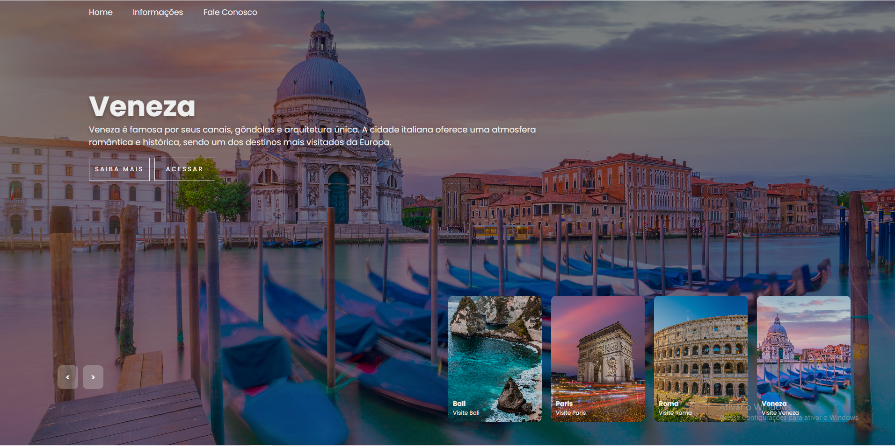

## 🚀 Funcionalidades

- ✅ Carrossel de imagens em tela cheia  
- ✅ Navegação por botões **Next / Prev**  
- ✅ Thumbnails clicáveis sincronizadas com o slide principal  
- ✅ Animações suaves com CSS  
- ✅ Layout moderno e responsivo  
- ✅ JavaScript puro (sem bibliotecas externas)

---

## 🛠️ Tecnologias Utilizadas

- **HTML5**
- **CSS3**
  - Flexbox
  - Animações com `@keyframes`
- **JavaScript (Vanilla JS)**
- **Google Fonts (Poppins)**

---

## 📸 Preview

🎯 Objetivo do Projeto

Este projeto foi desenvolvido com o objetivo de praticar:

Manipulação de DOM

Lógica de carrossel

Animações com CSS

Organização de código front-end

📌 Autor

Desenvolvido por Matheus Ciencia 💻
